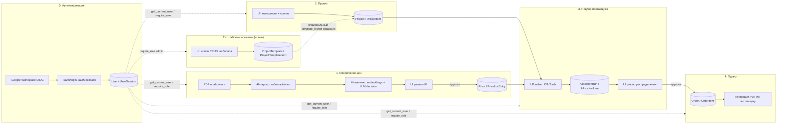

# Архитектура

Актуализируй эту диаграмму при каждом значимом структурном изменении — это основной
"граф знаний" проекта, читаемый и человеком, и Claude Code в начале сессии.

## Границы модулей

- **Auth** — Google Workspace OIDC (authorization code + PKCE), сессии в БД
  (`UserSession`), не JWT — см. `docs/decisions/0024-authentication-authorization.md`.
  Единственный источник identity/роли для всех остальных модулей.
- **Ingestion** — единственное место, где решения принимает LLM без гарантии
  правильности; поэтому всегда с человеческим ревью перед записью в `Price`.
- **Templates** — справочные данные (кто может создавать/редактировать шаблоны —
  `admin`, как `Supplier`/`Material`), применяются только опционально в момент
  создания `Project`, не архитектурная часть модуля 2. См.
  `docs/decisions/0032-project-templates.md`.
- **Allocation** — детерминированный сервис, без вызовов LLM. См. ADR по алгоритму.
- **Order generation** — чистая шаблонизация, без бизнес-логики.

Все 11 бизнес-роутеров (`supplier`/`material`/`category`/`price`/`price_ingestion`/
`template`/`project`/`allocation`/`order`/`purchase_record` + `/users`)
защищены на уровне `APIRouter(dependencies=[...])` — `require_role("admin")`
для справочных данных (`supplier`/`material`/`category`/`price`/`price_ingestion`/
`template`/`users`), `get_current_user` (любая роль) для операционной работы
(`project`/`allocation`/`order`/`purchase_record`) — см. ADR-0024 §4/§5,
ADR-0032 §2. `category` (`/categories`) — справочник категорий материала
(`Category`), заменяет хардкод-константу `STRICT_CATEGORIES` управляемым
через БД полем `requires_single_supplier`, и выдаёт `internal_sku` новым
материалам атомарно — см. `docs/decisions/0034-material-category-entity-and-sku-autogeneration.md`.
`health.py` остаётся публичным; `auth.py` смешанный (публичные `/login`,
`/callback`, защищённые `/me`, `/logout`).

## Связанные документы

- Данные: `docs/data-model.md`
- Решения: `docs/decisions/`
- Термины: `docs/glossary.md`
