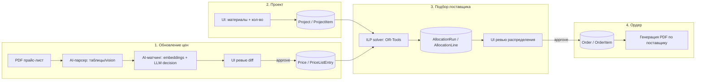

# Архитектура

Актуализируй эту диаграмму при каждом значимом структурном изменении — это основной
"граф знаний" проекта, читаемый и человеком, и Claude Code в начале сессии.

## Границы модулей

- **Ingestion** — единственное место, где решения принимает LLM без гарантии
  правильности; поэтому всегда с человеческим ревью перед записью в `Price`.
- **Allocation** — детерминированный сервис, без вызовов LLM. См. ADR по алгоритму.
- **Order generation** — чистая шаблонизация, без бизнес-логики.

## Связанные документы

- Данные: `docs/data-model.md`
- Решения: `docs/decisions/`
- Термины: `docs/glossary.md`
