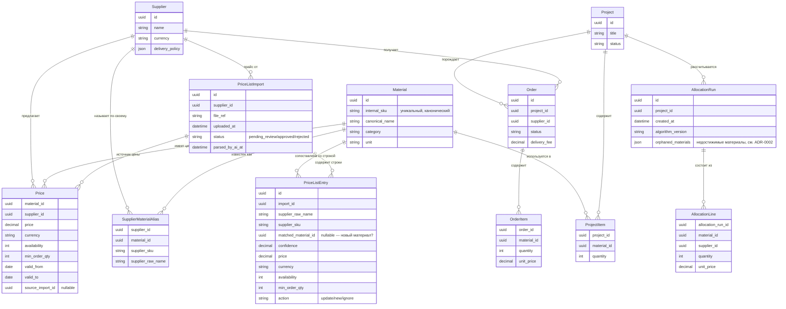

# Модель данных

Правило, которое нельзя нарушать без ADR: `Material.internal_sku` — единственный источник истины
об идентичности материала. `SupplierMaterialAlias` — единственное место, где допустимы
дублирующиеся/расходящиеся названия.

`PriceListImport`/`PriceListEntry` добавлены сверх исходной диаграммы — см. `docs/decisions/0001-price-list-import-table.md`.
`PriceListEntry` — черновые строки на ревью (до аппрува, не пишутся в `Price` напрямую).

`AllocationRun.orphaned_materials` добавлено сверх исходной диаграммы — см.
`docs/decisions/0002-supplier-allocation-algorithm.md`. Список материалов проекта,
недостижимых ни у одного поставщика в нужном количестве; чисто информационный для UI,
не участвует в дальнейших расчётах.
