# Модель данных

```mermaid
erDiagram
    Supplier ||--o{ Price : "предлагает"
    Supplier ||--o{ SupplierMaterialAlias : "называет по-своему"
    Supplier ||--o{ PriceListImport : "прайс от"
    Supplier ||--o{ Office : "имеет офисы"
    Supplier ||--o{ SupplierContact : "имеет контакты"
    Office ||--o{ SupplierContact : "опционально группирует"
    Material ||--o{ Price : "имеет цену у"
    Material ||--o{ SupplierMaterialAlias : "известен как"
    Material ||--o{ ProjectItem : "используется в"
    Material ||--o{ PriceListEntry : "сопоставлена со строкой"
    PriceListImport ||--o{ PriceListEntry : "содержит строки"
    PriceListImport ||--o{ Price : "источник цены"
    Project ||--o{ ProjectItem : "содержит"
    Project ||--o{ AllocationRun : "рассчитывается"
    AllocationRun ||--o{ AllocationLine : "состоит из"
    Project ||--o{ Order : "порождает"
    Order ||--o{ OrderItem : "содержит"
    Supplier ||--o{ Order : "получает"
    Project ||--o{ PurchaseRecord : "фактически закупает"
    Supplier ||--o{ PurchaseRecord : "продаёт по факту"
    Material ||--o{ PurchaseRecord : "опционально аннотирована как"

    Supplier {
        uuid id
        string name
        string currency
        json delivery_policy
        string website
        string region
        string catalog_link
        string status "свободный текст, не enum"
        string payment_terms "NET 30 и т.п.; отдельно от delivery_policy"
        string portal_url
        string comments
    }
    Office {
        uuid id
        uuid supplier_id
        string address
        string region "может быть шире одного адреса"
    }
    SupplierContact {
        uuid id
        uuid supplier_id
        uuid office_id "nullable"
        string name
        string role
        string phone
        string email
    }
    Material {
        uuid id
        string internal_sku "уникальный, канонический"
        string canonical_name
        string category
        string unit
    }
    SupplierMaterialAlias {
        uuid supplier_id
        uuid material_id
        string supplier_sku
        string supplier_raw_name
    }
    PriceListImport {
        uuid id
        uuid supplier_id
        string file_ref
        datetime uploaded_at
        string status "pending_review/approved/rejected"
        datetime parsed_by_ai_at
    }
    PriceListEntry {
        uuid id
        uuid import_id
        string supplier_raw_name
        string supplier_sku
        uuid matched_material_id "nullable — новый материал?"
        decimal confidence
        decimal price
        string currency
        int availability
        int min_order_qty
        string action "update/new/ignore"
    }
    Price {
        uuid material_id
        uuid supplier_id
        decimal price
        string currency
        int availability
        int min_order_qty
        date valid_from
        date valid_to
        uuid source_import_id "nullable"
    }
    Project {
        uuid id
        string title
        string status "draft/calculated/ordered/completed, см. ADR-0011"
    }
    ProjectItem {
        uuid project_id
        uuid material_id
        int quantity
    }
    AllocationRun {
        uuid id
        uuid project_id
        datetime created_at
        string algorithm_version
        string status "ok/infeasible, см. ADR-0003"
        json orphaned_materials "недостижимые материалы, см. ADR-0002"
    }
    AllocationLine {
        uuid allocation_run_id
        uuid material_id
        uuid supplier_id
        int quantity
        decimal unit_price
        uuid overridden_via_order_item_id "nullable, FK -> OrderItem — добавлено сверх исходной диаграммы, см. ADR-0014"
    }
    Order {
        uuid id
        uuid project_id
        uuid supplier_id
        string status
        decimal delivery_fee
    }
    OrderItem {
        uuid order_id
        uuid material_id
        int quantity
        decimal quoted_price
        decimal received_price "nullable — первый ответ поставщика, до торга"
        decimal confirmed_price "nullable — финальная договорённость"
        datetime confirmed_at "nullable"
        datetime declined_at "nullable — поставщик не может выполнить позицию"
        string decline_reason "nullable, свободный текст"
    }
    PurchaseRecord {
        uuid id
        uuid project_id
        uuid supplier_id
        string raw_description "свободный текст, не обязан матчиться на Material"
        int quantity
        decimal unit_price
        uuid material_id "nullable — опциональная ручная аннотация"
        datetime created_at
    }
```

Правило, которое нельзя нарушать без ADR: `Material.internal_sku` — единственный источник истины
об идентичности материала. `SupplierMaterialAlias` — единственное место, где допустимы
дублирующиеся/расходящиеся названия.

`PriceListImport`/`PriceListEntry` добавлены сверх исходной диаграммы — см. `docs/decisions/0001-price-list-import-table.md`.
`PriceListEntry` — черновые строки на ревью (до аппрува, не пишутся в `Price` напрямую).

`AllocationRun.orphaned_materials` добавлено сверх исходной диаграммы — см.
`docs/decisions/0002-supplier-allocation-algorithm.md`. Список материалов проекта,
недостижимых ни у одного поставщика в нужном количестве; чисто информационный для UI,
не участвует в дальнейших расчётах.

`AllocationRun.status` добавлено сверх исходной диаграммы — см.
`docs/decisions/0003-infeasible-allocation-status.md`. `"ok"` — модель решена;
`"infeasible"` — ILP-модель невыполнима целиком (например, `per_order_min_amount`
единственного поставщика материала не достигается) или на входе солвера не осталось
материалов после предобработки; `lines`/`supplier_summaries` в этом случае пустые,
но `AllocationRun` всё равно создаётся и сохраняется — попытка расчёта не теряется.

`Office`/`SupplierContact` добавлены сверх исходной диаграммы, новые поля на `Supplier`
(`website`, `region`, `catalog_link`, `status`, `payment_terms`, `portal_url`, `comments`) —
см. `docs/decisions/0010-supplier-directory-expansion.md`. Все справочные, ни одно не читается
ILP-солвером — единственное поле `Supplier`, влияющее на расчёт, по-прежнему `delivery_policy`.
`SupplierContact.office_id` nullable и удаление `Office` переводит `office_id` его контактов
в `NULL` (не блокирует и не каскадит удаление контактов) — офис не обязателен для контакта.
`SupplierContact.supplier_id` — намеренная денормализация поверх `office_id → Office.supplier_id`,
не выводится через join, чтобы "все контакты поставщика" не зависело от наличия office_id.

`PurchaseRecord` добавлена сверх исходной диаграммы — см.
`docs/decisions/0008-actual-purchase-record.md`. Журнал того, что реально
закупили, независимый от `Order`/`AllocationLine`: `raw_description` — как
сотрудник видит название у поставщика, не обязан матчиться на
`Material.canonical_name`/`SupplierMaterialAlias`; `supplier_id` может не
совпадать с поставщиком, для которого позиция планировалась; `material_id`
опционален и не участвует в расчётах, чисто ручная аннотация. Привязка —
на уровне `Project`, не `Order`/`AllocationLine` (запись может относиться к
поставщику, для которого в проекте вообще не создавался `Order`). Итоги
(`purchased_total` по проекту и по поставщику) сравниваются с
`Order.total_amount` — снимком на момент отправки, не с живым
`SupplierAllocationSummaryOut` — и равны `NULL`, если для
project/supplier ещё нет ни одного `Order` (нет базы для сравнения, не
ноль). Автоматическое сопоставление строк плана и факта по тексту — не
проектируется, экран показывает оба списка для визуальной сверки
человеком.

`Project.status` — добавлено сверх исходной диаграммы, см.
`docs/decisions/0011-project-status-lifecycle.md`. `draft → calculated →
ordered → completed`. Первые три перехода — автоматические, побочный
эффект `run_allocation()`/`create_orders_for_run()` (по наличию
`AllocationRun.status == "ok"` / `Order` для проекта, не по отдельному
действию пользователя). Только `AllocationRun` со статусом `"ok"` двигает
статус — `"infeasible"` не меняет его никогда, даже если это единственный
прогон у проекта. Повторный успешный расчёт на уже `ordered` проекте
откатывает статус в `calculated`. `ordered → completed` — единственный
ручной переход (кнопка «Завершить проект»), `completed` финален, без
обратного перехода.
