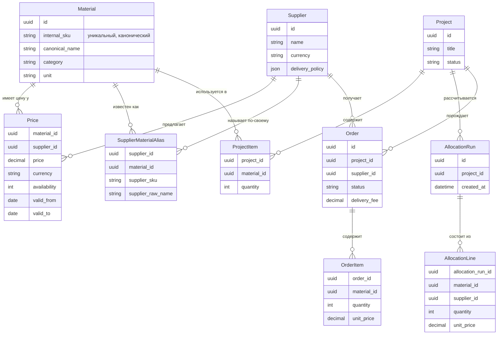

# Модель данных

Правило, которое нельзя нарушать без ADR: `Material.internal_sku` — единственный источник истины
об идентичности материала. `SupplierMaterialAlias` — единственное место, где допустимы
дублирующиеся/расходящиеся названия.
